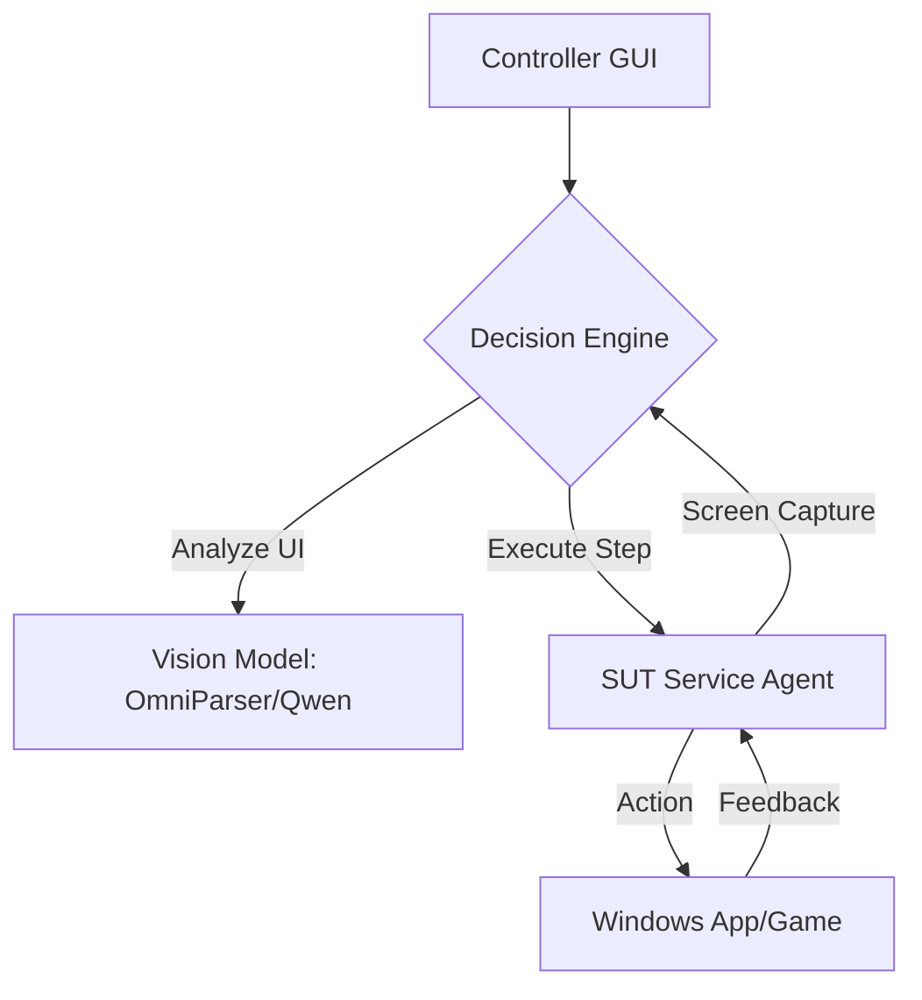

# 🌌 Gemma Framework: App Automation & Benchmarking

[](#)
[](#)
[](#)

Gemma is a powerful, computer vision-driven framework designed to automate, benchmark, and monitor desktop applications. By separating the **"Brain"** (AI decision-making) from the **"Hands"** (SUT Service), Gemma provides a scalable solution for complex UI navigation and hardware performance tracking.

---

## 🏗️ System Architecture

Gemma operates on a **Controller-Agent** model:

*   **The Controller**: Hosts the GUI, Decision Engine, and Vision Models.
*   **The Agent (SUT Service)**: Runs on the target machine, executing inputs and capturing raw screenshots via the Windows SendInput API.



---

## ✨ Key Features

### 🛠️ Workflow Builder
An interactive IDE-like tool for creating automation logic without writing code.
*   **Point & Click**: Capture screenshots and click UI elements to define steps.
*   **AI Detection**: Automatically suggests element types (icons, text, buttons).
*   **Real-time Testing**: Test individual actions or full flows instantly on the SUT.

### 🪝 Advanced Hooks & Sideloading (SDR Integration)
Fully integrated support for external diagnostic tools like **Intel System Data Recorder (SDR)**.
*   **Pre-Hooks**: Run scripts (e.g., `start_sdr.bat`) before the app starts.
*   **Post-Hooks**: Auto-collect logs and stop tracing after completion.
*   **Persistent Hooks**: Keep monitors running in the background throughout the test.
*   **Sideloading**: Run clean-up or verification scripts between specific steps.

### 📁 Smart "Automation Logs" System
A centralized output system that organizes every run chronologically:
*   **`Automation Logs/`**: The master directory for all production results.
*   **Visual Proof**: Every run includes raw screenshots and AI **Annotations** showing exactly *why* a click happened.
*   **Full Traces**: The `automation.log` captures all STDOUT/STDERR from your batch files and SDR scripts.

---

## 🚀 Quick Start

### 1. SUT Setup (Target Machine)
1.  **Requirement**: Admin Privileges (Right-click -> Run as Administrator).
2.  Install dependencies: `pip install flask pyautogui psutil pywin32 requests`
3.  Launch the agent:
    ```powershell
    python sut_service_installer/gemma_service_0.1.py
    ```

### 2. Controller Setup (Host Machine)
1.  Configure `mysuts.json` with your target IP.
2.  Launch the Multi-SUT Command Center:
    ```powershell
    python gui_app_multi_sut.py
    ```
3.  (Optional) Design a new flow: `python workflow_builder.py`

---

## 📂 Repository Breakdown

| Directory | Purpose |
| :--- | :--- |
| `Automation Logs/` | Chronological output of all performance runs, screenshots, and AI logs. |
| `config/apps/` | YAML-based workflow definitions (replaces legacy `config/games`). |
| `modules/` | Core engines: `simple_automation`, `decision_engine`, `network`. |
| `sut_service_installer/` | The lightweight agent designed for target hardware deployment. |
| `tracing_tools/` | Repository for SDR hooks and external benchmarking scripts. |

---

## 📋 Comprehensive Troubleshooting

*   **Case Sensitivity Issues?**: The framework uses bulk string input (`pyautogui.write`) to ensure Capital Letters and special characters are preserved exactly as entered in the Workflow Builder.
*   **Application Focus**: If an app starts hidden, the SUT Agent uses a robust Windows `AttachThreadInput` + `SetForegroundWindow` sequence to force focus before clicks occur.
*   **Script Failures**: Check the `automation.log` inside the `Automation Logs` folder to see the direct output of your `.bat` or `.py` hooks.

---

> [!NOTE]
> This framework is currently in **Rev0.1-feature-hooks** development. For detailed YAML syntax, refer to the [Quick Reference Guide](file:///c:/Users/nimishka/Downloads/1. PROJECTS/ISV AUTOMATION WITH VCAP/VCAP RELEASE/Gemma-rev0.1-feature-hooks-and-sideload/config/QUICK_REFERENCE.md).
